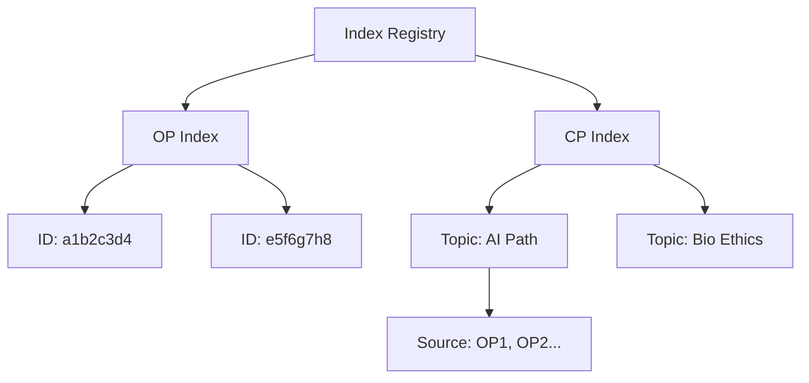
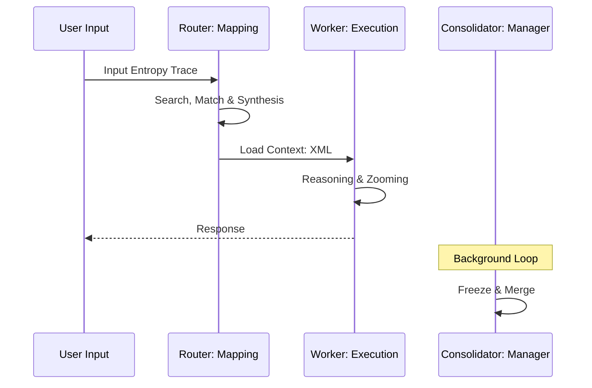
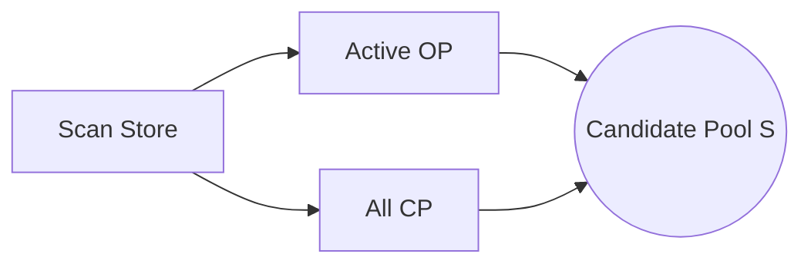
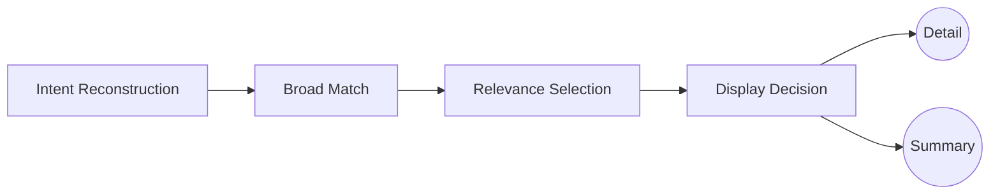
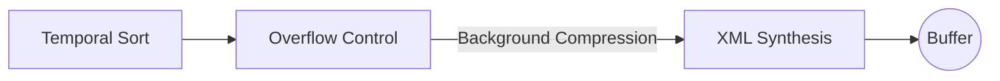
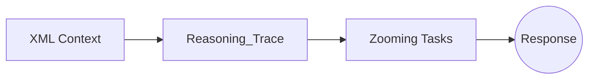
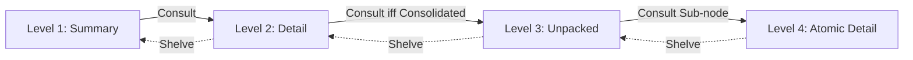

# Paged-Context-Protocol (PCP) v1.0

PagedContext (PCP) is a context management protocol focused on **logical addressing** and **multi-topic parallel processing** for LLMs. At its core, it transforms continuous Token streams into discrete, addressable **Logical Pages**, solving context pollution caused by abrupt topic shifts in long-range interactions and achieving high-density information precision.

## I. Vision & Philosophy

The design of PCP is inspired by the **Virtual Memory** management mechanisms of computer systems. We believe that context management for LLMs is essentially maintaining a **Context Address Space**:

*   **Context Virtualization**: `Original Pages` simulate "Hot Data," filling the physical cache (Context Window) with high-resolution (Detail) content.
*   **Physical Cache vs. Virtual Addressing**: RAG systems only solve the "presence" of information, whereas PCP solves the "resolution" of information. Through tiered pre-fetching of `Consolidated Pages`, the system implements a virtualized mapping of infinite logical space within a limited physical cache.
*   **Demand Paging**: The Worker should not passively parse streaming tokens but should act as a **Memory Management Unit (MMU)**, triggering a **Consult (Page In)** exception to load deep raw data on demand.
*   **Logical Sovereignty (Resolution Control)**: Pages in a `Focused` state hold the highest addressing weight. Other background information maintains logical topology at low resolution (Summary), preventing "Context Overflow."

## II. Trio Actor Model

The system operates based on the decoupled collaboration of three core roles, ensuring the separation of "governance" and "execution":

1.  **Governance Actor (Router/MMU)**: 
    *   **Responsibility**: Logical coordinate mapping (Logical Mapping). Handles intent recognition, logical page indexing, and two-stage relevance matching.
    *   **Core Decision**: Performs real-time analysis of address space mappings, deciding which Pages to Cache in the physical context and in what resolution (Summary/Detail).

2.  **Execution Actor (Worker/CPU)**: 
    *   **Responsibility**: Task execution. Possesses **addressing autonomy**.
    *   **Core Action**: Analyzes the current context to decide whether to trigger a **Page Fault** via `Consult` to load deeper details or use `Shelve` to evict overloaded physical pages.

3.  **Refinement Actor (Consolidator/Background GC)**: 
    *   **Responsibility**: Physical maintenance of storage space (Memory Manager).
    *   **Core Action**: 
        1.  **Initial Freezing**: Monitors topic states and length thresholds, Swapping Out active `Original Pages` into `Consolidated Pages`.
        2.  **Long-term Merging**: Scans adjacent, same-topic summary pages with a long interval between occurrence and current physical time ($T_{now}$) (reaching a staleness threshold) and performs logical merging to ensure extreme refinement of long-cycle logic.

## III. The Temporal Coordination System

PCP uses a **Timeline** as the core specification for logical ordering and focus guidance:

*   **Timestamp Anchoring**: Every logical page (Original/Consolidated) must carry an absolute timestamp anchor.
*   **Current Time Injection**: `Current_Time` is explicitly injected at the top of the context for every interaction.
*   **Worker's Temporal Awareness**: The Worker compares Page timestamps with `Current_Time` to judge logical sequence, aiding in the execution of `Consult` (tracing history) or `Shelve` (jumping out of the current discussion).

## IV. Logical Entities & Manifests

All logical pages (Original/Consolidated) consist of both **Content** and a **Manifest**:

### 4.1 Original Page
The smallest unit recording a single dialogue or microscopic logical fragment, **retained only in the latest active context**.

*   **Content**: Contains the original dialogue stream of that logical fragment ($U_{now} + W_{now}$).
*   **Manifest**:
    *   `ID`: Short Hash (8-12 hex characters, e.g., `8a1b2c3d`).
    *   `Timestamp`: Absolute physical time.
    *   `Semantic Clusters`: A set of core keywords.
    *   `Summary`: **Minimum refinement preserving the original logical thread**. No strict word limit; the core requirement is to fully preserve the chain of reasoning, clear conclusions, and conceptual negations or corrections (logical negative proof), strictly prohibiting the cutting of effective information due to length constraints.

### 4.2 Consolidated Page
Solidified consensus points for logical units.

*   **Generation Logic**: 
    1.  **Topic Pivot**: Triggered when the Router detects a drastic shift in user intent.
    2.  **Length Overflow**: Triggered when active Original Pages accumulate beyond a certain Token length.
*   **Content**: Logical synthesis and consensus solidification of all contained original pages.
*   **Manifest**:
    *   `ID`: Short Hash.
    *   `Source Page Ids**: An array of IDs of all included sub-pages.
    *   `Summary**: **Minimum refinement preserving the entire logical thread**. Requires full preservation of logical conflict points, reasoning evolution, and final consensus conclusions.
*   **Post-processing Logic**: Adjacent same-topic summary pages are scanned and merged by the Consolidator.

### 4.3 Page Index Management System

To support second-level retrieval and logical zooming of massive Pages, PCP maintains a lightweight **index management system**:

*   **Unique Addressing**: Every Page (OP/CP) has a globally unique `Short Hash ID` in the index.
*   **State Maintenance**: The index tracks the **heat level**, **staleness**, and **current activation status** (whether it's injected into the context) of Pages in real-time.
*   **Parallel Topic Topology**: When multiple topics are reasoned in parallel, the index partitions logical space via `Topic ID`, ensuring the Router can quickly perform isolation and pressure relief during retrieval.



## V. The Lifecycle

When a user inputs $U_{now}$, the system performs a complete "breath" cycle. This process ensures the model sees both the panorama and precisely located details:



### 1. Perception: Building Logical Radar
*   **Task**: Define the boundaries of all information currently "visible" to the system.
*   **Action**: Scan all `IndexPages` (Consolidated Pages) and current active `OriginalPages` (Original Pages) that have not yet been summarized.
*   **Output**: Retrieval Candidate Pool $\mathcal{S}$.



### 2. Cascade: Intent Awareness & Two-Stage Matching
*   **Intent Detection & Reconstruction**:
    *   If the entropy of $U_{now}$ is too low (e.g., "continue"), the system forces **Intent Reconstruction**: merging the previous page's `Summary` with the current input to form a high-entropy reconstructed query.
*   **Stage 1: Broad Semantic Match**:
    *   The Router first performs a broad initial screening of the candidate pool $\mathcal{S}$ based on `Semantic Clusters`, excluding logically unrelated topics.
*   **Stage 2: Precision Relevance Selection**:
    *   Performs a secondary relevance match on the initial results based on the `Summary`.
    *   **Criterion: Only inject content with actual relevance**.
*   **Display Decision**:
    *   **Full Injection (Detail)**: Pages judged to be highly relevant.
    *   **Summary Injection (Summary)**: Pages judged to be moderately relevant or serving as background references.



### 3. Synthesis: Physical Structuring & Overflow Governance
*   **Ordering**: Strictly physically order the screened content according to **Timestamps**.
*   **Overflow Control**:
    *   When the total Tokens after assembly exceed the context threshold, the system triggers a **Dual-Decay Algorithm**: considering both **Timestamp** and **Relevance**.
    *   **Background Compression**: For pages that are distant in time and low in relevance, the system summarizes them into a unified `<Background_Context>` description. This simulates the brain's "summary-style forgetting" of past minor details, freeing up physical window space.
*   **Structuring**: Packetize content using specific XML tags (see Chapter VII).
*   **Injection**: Inject the synthesized XML Context into the Worker's input buffer, explicitly injecting the `Current_Time` scale.



### 4. Execution: Zooming & Tracing
*   **Execution**: Worker receives the context.
*   **Tracing**: Faithfully record the derivation process after each summary reading in the `<Reasoning_Trace>` tag.
*   **Zooming**: If the current context information is insufficient, the Worker actively calls `Consult` to expand a Summary. If information is overloaded, call `Shelve` to fold nodes.



### 5. Memory Consolidation & Archiving

The Consolidator actor handles system storage maintenance. Its actions are divided into **event-driven** and **independent scheduled-driven** modes:

*   **Initial Freezing**: 
    *   **Trigger**: Real-time monitoring of derivation entropy. When a Topic Pivot or Token overflow is detected, trigger the `Original -> Consolidated` conversion.
    
    ```mermaid
    graph LR
        OP[Original Pages] -->|Pivot or Overflow| C1[Freezing]
        C1 --> CP[Consolidated Pages]
    ```

*   **Metabolic Merging**:
    *   **Trigger**: **Independent scheduled background tasks** (e.g., executed every 12 hours or during system idle periods).
    *   **Logic**: Perform **logical pruning** on far-field memory along the timeline. When the generational gap between adjacent same-topic summary pages and the current physical time ($T_{now}$) exceeds a staleness threshold, perform physical merging.
    
    ```mermaid
    graph LR
        CP1[Recent CP] -- Over Time --> CP2[Old CP]
        CP2 -->|Staleness Threshold| C2[Merging]
        C3[Adjacent Same-Topic CP] --> C2
        C2 --> MA[Merged Archive]
    ```

> [!TIP]
> **Practical Reference**: For a detailed simulation of the above full-lifecycle process in complex dialogues, please refer to: [Lifecycle Walkthrough Case Study: Global Energy Transition Strategy Analysis](./examples/LIFECYCLE_WALKTHROUGH-en.md).

---

## VI. Zooming Mechanics

Zooming is the core path for PCP to maintain "both seeing the forest and clearly seeing every tree" during extremely long interactions.

### 6.1 Semantic View States

To allow the model to intuitively perceive reading depth and physical attributes (atomic level vs. container level), PCP employs a semantic view system:

1.  **`view="Summary"` (Summary)**: Shows logical extraction, hiding underlying data.
2.  **`view="Detail"` (Detail)**: Shows the full content of the page.
    *   **Original Node (Atomic)**: The logical endpoint, cannot be further deconstructed.
    *   **Consolidated Node (Container)**: A logical pivot point, can be further deconstructed.
3.  **`view="Unpacked"` (Unpacked)**: 
    *   **Constraint**: **Only applicable to `type="Consolidated"` nodes**. Must satisfy the "Active Zoom" constraint: it must contain **at least one** sub-node in a state other than `Summary` (i.e., `Detail` or deeper), otherwise it should automatically trigger a `Shelve` back to the `Detail` state to keep the context compact.
    *   **Behavior**: Removes the synthesis text and directly nests internal sub-pages (`Node`).

### 6.2 Recursive Zooming Path Mapping

*   **Level 1: Global Perception**: Pages (Original/Consolidated) in view are presented in the `Summary` state.
*   **Level 2: Single Page Penetration**: `Consult(id)` moves the target into `Detail`.
*   **Level 3: Container Deconstruction**: For a **Consolidated** node already in `Detail`, calling `Consult` moves it into `Unpacked`, revealing the `Summary` of internal sub-pages.
*   **Level 4: Atomic Restoration**: For a revealed sub-page (Original), calling `Consult` moves it into `Detail`, reaching the original evidence.



> [!TIP]
> **Practical Reference**: For a pathfinding simulation of Level-4 Zooming in extremely complex scenarios, please refer to: [Zooming Deep Dive Case Study: Vision Zooming in Complex Philosophical Deduction](./examples/ZOOMING_DEEP_DIVE-en.md).

### 6.2 Dynamic Zooming via Function Calling

Zooming operations are implemented via the system's **Function Calling** mechanism, which is key for the Worker to achieve dynamic zooming.

| Action | Call Format | Trigger Condition | Effect |
| :--- | :--- | :--- | :--- |
| **Consult** | `Consult(reason, id)` | Current view depth is insufficient for conclusion | **View Upgrade**: `Summary -> Detail` or `Detail -> Unpacked`. |
| **Shelve** | `Shelve(reason, id)` | Current detail node is no longer relevant | **View Downgrade**: `Unpacked -> Detail` or `Detail -> Summary`. |

**Parameter Descriptions**:
*   **reason**: Logical reason for zooming. **Must be truthful and specific**; it will be automatically recorded in the `<Reasoning_Trace>` of the next round to provide pathfinding reference for the model.
*   **ids**: One or more Page IDs to operate on.

### 6.3 Cascading Shelve / Auto-Folding

To maintain extreme context purity, `Shelve` operations possess **cascading folding** characteristics:
*   **Atomic-level Trigger**: When an atomic Page in a `Detail` state is `Shelved`, it immediately reverts to `Summary`.
*   **Container-level Collapse**: When a summary page in Level 3 (Unpacked state) has all its internal sub-page IDs successfully `Shelved` (folded) by the Worker, the summary page node must **automatically collapse upward**, reverting to the Level 2 (Detail) state.
*   **Logical Goal**: Ensure that only "explicitly needed details" exist in the cognitive horizon, leaving no logical redundancy.

## VII. XML Spec

### 7.1 XML Synthesis vs. Semantic Gluing

PCP does not simply "glue" text together but provides a perception interface for the Worker through **Ordered XML Synthesis**.
*   **Deterministic Scaffolding**: Textual gluing (Semantic Gluing) easily leads to cognitive confusion (i.e., hallucination drift) between "metadata" and "dialogue content." XML provides clear logical isolation.
*   **Cognitive Anchors**: Tags serve as "cognitive anchors," allowing the system to perform precise context pruning, folding, and reorganization without interfering with the model's semantic understanding.
*   **Structured Tracing**: Machine-readable tags create a strict closed-loop mapping between function operations like `Consult/Shelve` and content presentation.

### 7.2 Tag Specifications

*   **`<PagedContext>`**: Protocol root container, carries `version` number.
*   **`<Static_Registry>`**: Static registry. Injects global constants and **runtime instructions** that do not change with the dialogue.
    *   **`<System_Instructions>`**: **Core instruction injection**. Informs the Worker of the protocol's operating manual, defining triggers and logical goals for `Consult/Shelve`.
*   **`<Query>`**: **Current user input**. The system performs intent recognition and cascading matching based on this input.
*   **`<Reasoning_Trace>`**: **Reasoning process record**. Consists of a series of `<Step>` nodes recording all zooming actions taken by the Worker in previous rounds.
    *   **`<Step>`**: Specific action item. Includes `action` (action name), `target` (target ID), and `reason` (logical motivation).
*   **`<Linear_Flow>`**: **Linear memory flow**. A collection of Page nodes representing the current "viewable content."
*   **`<Node>`**: Logical page container.
    *   `id`: unique Short Hash identifier.
    *   `type`: **Physical page attribute (Original | Consolidated)**.
    *   `view`: **Semantic view (Summary | Detail | Unpacked)**.
    *   `timestamp`: The time origin of the logical occurrence.

---

### 7.3 Abstract Boilerplate

Standard generation template for system integration:

```xml
<PagedContext version="1.0">
  <Static_Registry>
    <ST-Node id="CURRENT_TIME" value="YYYY-MM-DDTHH:mm:ss" />
    <System_Instructions>
      - Original: original evidence/dialogue node (non-deconstructible).
      - Consolidated: logical synthesis node (can be Unpacked).
      - view="Summary": abstract; view="Detail": full text; view="Unpacked": expand container internals.
      - Consult(reason, id): upgrade view for details/sub-items; Shelve(reason, id): downgrade view to clean horizon.
    </System_Instructions>
  </Static_Registry>

  <Query>...</Query>

  <Reasoning_Trace>
    <Step action="Consult" target="PageID" reason="Seeking original evidence support behind high-level logic." />
  </Reasoning_Trace>

  <Linear_Flow>
    <!-- 1. Original Summary -->
    <Node id="f1a2b3c4" type="Original" view="Summary" timestamp="2026-02-14T10:00:00">
      <Summary>Background reference summary...</Summary>
    </Node>

    <!-- 2. Original Detail - Logical Endpoint -->
    <Node id="d4e5f6a1" type="Original" view="Detail" timestamp="2026-02-14T10:05:00">
      <Content>Full bottom-level dialogue text or hardware raw logs...</Content>
    </Node>

    <!-- 3. Consolidated Summary -->
    <Node id="b2c3d4e5" type="Consolidated" view="Summary" timestamp="2026-02-14T10:10:00">
      <Summary>Preliminary consensus summary synthesized from 10 OP pages.</Summary>
    </Node>

    <!-- 4. Consolidated Detail - Recursive Transit -->
    <Node id="c3d4e5f6" type="Consolidated" view="Detail" timestamp="2026-02-14T10:15:00">
      <Content>Consolidated full text, containing complete logical deductions. Drilling down is possible here.</Content>
    </Node>

    <!-- 5. Consolidated Unpacked - Direct Nesting -->
    <Node id="e5f6a7b8" type="Consolidated" view="Unpacked" timestamp="2026-02-14T10:20:00">
       <Node id="a7b8c9d0" type="Original" view="Summary" timestamp="..." />
       <Node id="f9e8d7c6" type="Original" view="Summary" timestamp="..." />
    </Node>
  </Linear_Flow>
</PagedContext>
```

---
