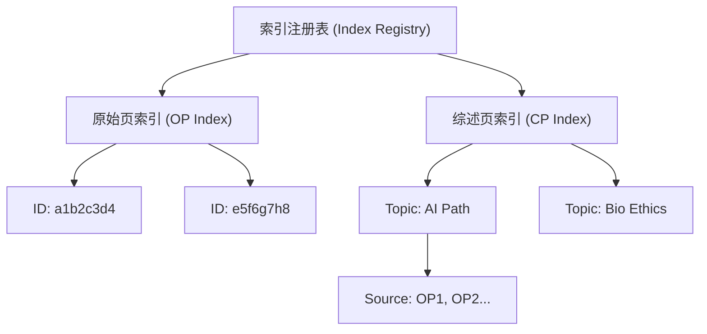
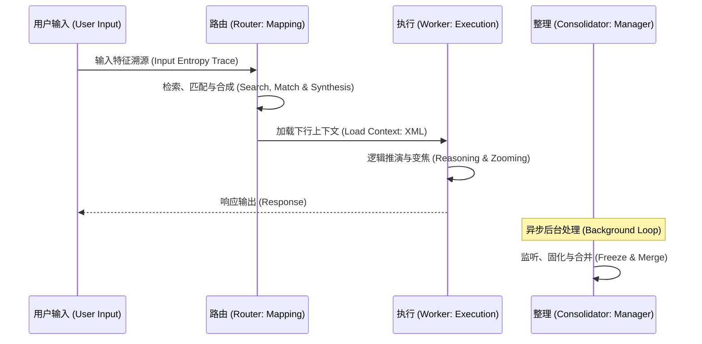
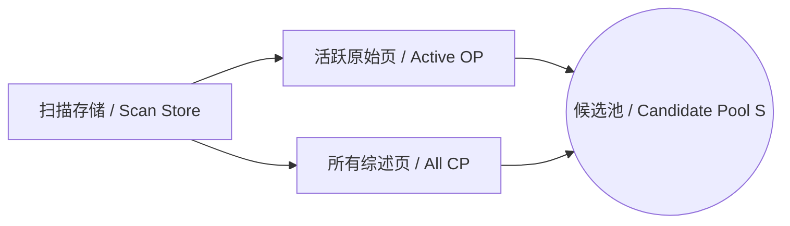
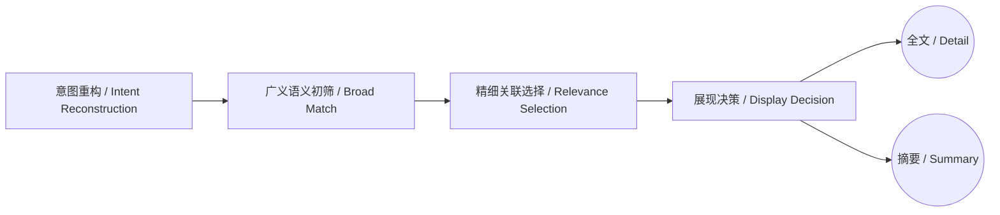
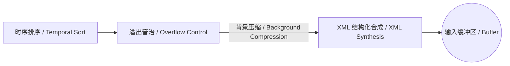
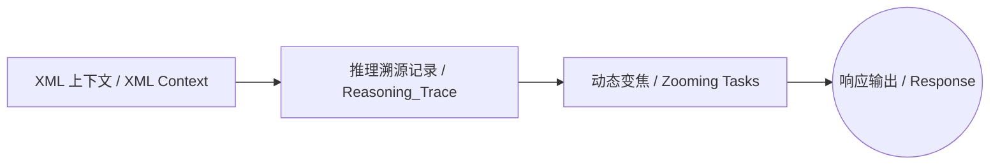
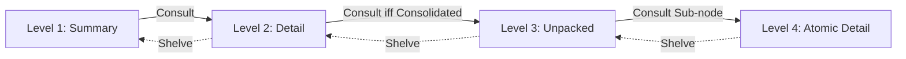

# Paged-Context-Protocol (PCP) v1.0

PagedContext (PCP) 是一种专注于 LLM **逻辑寻址**与**多主题并行处理**的上下文管理协议。其核心通过将连续的 Token 流转化为离散的、可寻址的**逻辑页（Logical Pages）**，解决长程交互中话题剧烈跳动导致的上下文污染，实现高密度的信息精准投喂。

## I. 核心愿景 (Vision & Philosophy)

PCP 的设计灵感来源于计算机系统的**虚拟内存（Virtual Memory）**管理机制。我们认为，LLM 的上下文管理本质上是在维护一个**地址空间（Address Space）**：

*   **上下文虚拟化 (Context Virtualization)**：`Original Pages` 模拟“热数据（Hot Data）”，通过高分辨率（Detail）填充物理缓存（Context Window）。
*   **物理缓存 vs. 虚拟寻址**：RAG 仅解决了信息的“存在性”，而 PCP 解决了信息的“分辨率”。通过 `Consolidated Pages` 的分级预读，系统在有限的物理缓存内实现了无限逻辑空间的虚拟化映射。
*   **按需分页 (Demand Paging)**：Worker 不应被动解析流式 Token，而应作为“内存管理单元 (MMU)”，通过 **Consult (Page In)** 触发异常处理，按需调取深层原始数据。
*   **神经逻辑控制 (Active Neural Logic)**：PCP 不设定死板的相似度阈值或字数公式。系统将 LLM 视为具备“动态常识”的基础算子。所有关于页面相关性、展现分辨度以及记忆剪裁的决策，均由算子通过其庞大的神经计算网络动态决定，实现比向量检索更具“逻辑语境感”的精准控制。
*   **逻辑主权 (Resolution Control)**：当前处于 `Focused` 状态的页面拥有最高寻址权重，其余背景信息以低分辨率（Summary）维持逻辑拓扑，防止“地址溢出（Context Overflow）”。


## II. 算子角色模型 (Trio Actor Model)

系统运行依赖于三个核心角色的解耦协作，确保“管治”与“执行”的分离：

1.  **管治算子 (Router-MMU)**: 
    *   **职责**: 逻辑坐标映射（Logical Mapping）。负责意图识别、逻辑页索引、以及两阶段相关性匹配。
    *   **核心特性**: **神经寻址而非数值检索**。Router 利用 LLM 的高维语义空间来评估 Query 与 Page Summary 之间的深层逻辑关联，而非依赖脆弱的向量余弦相似度。

2.  **执行算子 (Worker-CPU)**: 
    *   **职责**: 任务执行。具有**寻址自主权**。
    *   **核心动作**: 作为推理的核心，通过分析当前上下文的熵值与推导深度，动态决定是否通过 `Consult` 触发“页面异常（Page Fault）”并加载更深的细节。

3.  **整理算子 (Consolidator-Background GC)**: 
    *   **职责**: 系统存储空间的后台维护（Memory Manager）。
    *   **核心动作**: 
        1.  **初始固化 (Freezing)**：监听话题状态与长度阈值。其“话题转折（Topic Pivot）”的判定是基于推理逻辑的突变，而非简单的语义距离。
        2.  **长效整合 (Merging)**：基于逻辑陈旧度执行“代谢合并”。


## III. 时间定标系统 (The Temporal Coordination System)

PCP 采用**时间轴 (Timeline)** 作为逻辑排序与关注度引导的核心规范：

*   **时间戳锚定**: 每一个逻辑页（Original/Consolidated）都必须携带绝对时间戳锚点。
*   **当前时间注入**: 在每次交互的上下文顶部，显式注入 `Current_Time`。
*   **Worker 的时序感知**: Worker 通过对比 Page 时间戳与 `Current_Time` 判断逻辑的先后顺序，辅助执行 `Consult`（追溯历史）或 `Shelve`（跳出当前讨论）。

## IV. 逻辑实体规范 (Logical Entities & Manifests)

所有的逻辑页（Original/Consolidated）均由 **内容 (Content)** 与 **清单 (Manifest)** 两部分构成：

### 4.1 原始页 (Original Page)
记录单次对话或微观逻辑分片的最小单元，**仅存在于最新的活跃上下文中**。

*   **内容 (Content)**: 包含该逻辑分片的原始对话流（$U_{now} + W_{now}$）。
*   **清单 (Manifest)**:
    *   `ID`: Short Hash (8-12位 16进制，例: `8a1b2c3d`)。
    *   `Timestamp`: 物理发生的绝对时标。
    *   `Semantic Clusters`: 核心关键词集合。
    *   `Summary`: **保留原文逻辑脉络的最小提炼**。不强制字数限制，核心要求是必须完整保留推导链条、明确结论以及对概念的否定或修正（逻辑负向证明），严禁因长度限制而切断有效信息。

### 4.2 综述页 (Consolidated Page)
对逻辑单元的共识固化点。

*   **生成逻辑**: 
    1.  **话题转折 (Topic Pivot)**: 当 Router 检测到用户意图发生剧烈偏移时。
    2.  **长度溢出**: 当活跃的 Original Pages 累积超过一定 Token 长度时。
*   **内容 (Content)**: 对所包含原始页全部内容的逻辑综述与共识固化。
*   **清单 (Manifest)**:
    *   `ID`: Short Hash。
    *   `Source Page Ids`: 所包含的所有子页面 ID 数组。
    *   `Summary`: **保留整组逻辑脉络的最小提炼**。要求完整保留逻辑冲突点、推导演化过程以及最终共识结论。
*   **后处理逻辑**: 由 Consolidator 扫描并合并相邻的同主题综述页。

### 4.3 页索引管理系统 (Page Index Management System)

为了支撑海量 Page 的秒级检索与逻辑变焦，PCP 维护了一个轻量级的**索引管理系统**：

*   **唯一寻址**: 每一个 Page（OP/CP）在索引中拥有全局唯一的 `Short Hash ID`。
*   **状态维护**: 索引实时跟踪 Page 的**热度**、**陈旧度**以及**当前激活状态**（是否已注入上下文）。
*   **并行主题拓扑**: 当多个主题并行推导时，索引通过 `Topic ID` 划分逻辑空间，确保 Router 在检索时能够快速执行隔离分压。



## V. 系统运行生命周期 (The Lifecycle)

当用户输入 $U_{now}$ 时，系统执行一个完整的“呼吸”循环。这个流程确保了模型既能看见全景，又能精准定位细节：




### 1. 感知构建 (Perception: 建立逻辑雷达)
*   **任务**: 确定系统当前“看得见”的所有信息边界。
*   **操作**: 扫描所有的 `IndexPages`（综述页）和当前尚未被综述的活跃 `OriginalPages`（原始页）。
*   **产出**: 检索候选池 $\mathcal{S}$。



### 2. 级联分压 (Cascade: 意图感知与两阶段匹配)
*   **意图检测与重构 (Deterministic Reconstruction)**:
    *   **触发**: 当 $U_{now}$ 熵值过低（例如“继续”、“下一步”、“还有吗”）导致 Router 无法直接匹配语义时。
    *   **处理逻辑**: 此过程由**外部系统宿主代码 (Host Scaffolding)** 强制执行，而非 Router LLM 的推理。系统直接调取上一轮的 `Summary` 与当前输入拼接，生成预设的高熵重构查询。这确保了寻址的确定性，不依赖模型的发散理解。
*   **第一阶段：广义语义匹配 (Broad Match)**:
    *   Router 算子首先根据 `Semantic Clusters` 对候选池 $\mathcal{S}$ 进行广义初筛，排除逻辑无关的主题。
*   **第二阶段：精细关联度选择 (Relevance Selection)**:
    *   基于 `Summary` 对初筛结果进行二次关联度匹配。
    *   **准则：只注入具有实际关联的内容**。
*   **展现决策**:
    *   **全文注入 (Detail)**: 判定为极高相关性的 Page。
    *   **摘要注入 (Summary)**: 判定为中高相关或作为背景参考的 Page。



### 3. 合成与注入 (Synthesis: 物理结构化与溢出管治)
*   **排序**: 将筛选出的内容按照**时间坐标 (Timestamp)** 进行严格的物理排序。
*   **溢出治理 (Overflow Control)**:
    *   当拼装后的总 Token 超过上下文阈值时，系统触发**双重衰减算法**：综合考量**时间 (Timestamp)** 和 **关联度 (Relevance)**。
    *   **背景压缩**: 对于那些时间久远且相关度低的页面，系统将其合并总结为一段统一的 `<Background_Context>` 描述。这模拟了大脑对过往次要细节的“综述性遗忘”，释放物理窗口空间。
*   **结构化**: 使用特定的 XML 标签（见第七章）对内容进行封包。
*   **注入**: 将合成后的 XML Context 注入 Worker 的输入缓冲区，并显式注入 `Current_Time` 标尺。



### 4. 交互执行 (Execution: 变焦与溯源)
*   **执行**: Worker 接收上下文。
*   **溯源**: 在 `<Reasoning_Trace>` 标签中如实记录每一次阅读摘要后的推导过程。
*   **变焦**: 如果当前上下文信息不足，Worker 主动调用 `Consult` 展开 Summary。若信息过载，调用 `Shelve` 折叠节点。



### 5. 记忆固化与背景归档 (Memory Consolidation & Archiving)

Consolidator 算子承担了系统存储空间的维护职责。其动作分为**事件驱动**与**独立定时驱动**两种模式：

*   **初始固化 (Freezing)**: 
    *   **触发**: 实时监听推导熵值。当检测到话题转折（Topic Pivot）或 Token 溢出时，触发 `Original -> Consolidated` 的转换。
    
    ```mermaid
    graph LR
        OP[原始页 / Original Pages] -->|话题转折或溢出 / Pivot or Overflow| C1[初始固化 / Freezing]
        C1 --> CP[综述页 / Consolidated Pages]
    ```

*   **时间驱动剪裁 (Metabolic Merging)**:
    *   **触发**: **独立定时异步任务**（如每 12 小时执行一次或在系统空闲时段触发）。
    *   **逻辑**: 沿着时间轴对远场记忆执行**逻辑剪裁**。当相邻的同主题综述页的代差与当前物理时间 ($T_{now}$) 的距离超过陈旧度阈值时，执行物理合并。
    
    ```mermaid
    graph LR
        CP1[近期综述 / Recent CP] -- 随时间推移 / Over Time --> CP2[远期综述 / Old CP]
        CP2 -->|陈旧度越限 / Staleness Threshold| C2[逻辑剪裁与合并 / Merging]
        C3[邻近同主题综述 / Adjacent Same-Topic CP] --> C2
        C2 --> MA[背景化归档 / Merged Archive]
    ```

> [!TIP]
> **实战参考**：关于上述全周期流程在复杂对话中的具体推演过程，请参阅：[生命周期实战范例：全球能源转型战略分析](./examples/LIFECYCLE_WALKTHROUGH.md)。

---

## VI. 级联检索与 4 级递归变焦 (Zooming Mechanics)

变焦机制是 PCP 如何在极长交互中保持“既看清森林，又看清每一棵树”的核心路径。

### 6.1 三大语意视图 (Semantic View States)

为了让模型直观感知识读深度与物理属性（原子级 vs 容器级），PCP 采用语意视图系统：

1.  **`view="Summary"` (摘要)**: 展示逻辑提炼，隐藏底层数据。
2.  **`view="Detail"` (详情)**: 展示页面的完整内容。
    *   **Original 节点 (原子)**: 此为逻辑终点，不可再解构。
    *   **Consolidated 节点 (容器)**: 此为逻辑支点，可进一步解构。
3.  **`view="Unpacked"` (解构)**: 
    *   **约束**: **仅适用于 `type="Consolidated"` 节点**。且必须满足“激活变焦”约束：其内部必须**至少有一个**子节点处于非 `Summary` 状态（即 `Detail` 或更深），否则应自动执行 `Shelve` 回退至 `Detail` 态以保持视界紧凑。
    *   **表现**: 移除综述全文，直接嵌套展示其内部包含的子页面 (`Node`)。

### 6.2 递归变焦路径映射

*   **1级：全局感知**: 视界内的页面（Original/Consolidated）以 `Summary` 态呈现。
*   **2级：单页穿透**: `Consult(id)` 使目标进入 `Detail`。
*   **3级：容器拆解**: 对已处于 `Detail` 的 **Consolidated** 节点调用 `Consult`，使其进入 `Unpacked` 露出内部子页面的 `Summary`。
*   **4级：原子还原**: 对展开的子页面 (Original) 调用 `Consult`，使其进入 `Detail` 触达原始证据。



> [!TIP]
> **实战参考**：关于 4 级变焦在极端复杂场景下的寻址路径演练，请参阅：[变焦深潜实战：复杂哲学推演中的视界变焦](./examples/ZOOMING_DEEP_DIVE.md)。

### 6.2 变焦算子动作定义 (Dynamic Zooming via Function Calling)

变焦操作通过系统的 **Function Calling** 机制实现，这是 Worker 实现动态变焦的关键。

| 动作 | 调用格式 | 触发条件 | 效果 |
| :--- | :--- | :--- | :--- |
| **Consult** | `Consult(reason, id)` | 现有视图深度不足以支撑结论 | **视图升级**：`Summary -> Detail` 或 `Detail -> Unpacked`。 |
| **Shelve** | `Shelve(reason, id)` | 当前细节节点不再相关 | **视图降级**：`Unpacked -> Detail` 或 `Detail -> Summary`。 |

**参数说明**:
*   **reason**: 变焦的逻辑原因。**必须真实、具体**，它会被自动记录在下一轮的 `<Reasoning_Trace>` 中，为模型提供下一步的寻址参考。
*   **ids**: 需要执行操作的一个或多个 Page ID。

### 6.3 级联折叠逻辑 (Cascading Shelve / Auto-Folding)

为了保持上下文的极致纯净，`Shelve` 操作具备**级联折叠**特性：
*   **原子级触发**：当一个处于 `Detail` 状态的原子 Page 被 `Shelve` 后，它立即回退为 `Summary`。
*   **容器级坍缩**：当一个处于 Level 3（综述解构状态）的综述页，其内部包含的所有子页面 ID 都被 Worker 成功 `Shelve`（折叠）后，该综述页节点必须**自动向上坍缩**，回退到 Level 2（综述全文摘要）状态。
*   **逻辑目标**：确保思维视界中只存在“被明确需要的细节”，不留任何逻辑冗余。

## VII. 技术语法与协议规范 (XML Spec)

### 7.1 为什么采用 XML 级联 (XML Synthesis vs. Semantic Gluing)

PCP 并不简单地将文本“黏合”在一起，而是通过 **XML 有序合成** 为 Worker 提供感知界面。
*   **确定性支架**：纯文本黏合（Semantic Gluing）容易导致模型对“元数据”与“对话内容”产生认知混淆（即幻觉漂移）。XML 提供了明确的逻辑隔离。
*   **认知锚点**：标签（Tag）作为“认知锚点”，允许系统在不干扰模型语义理解的前提下，进行精确的上下文剪裁、折叠与重组。
*   **结构化溯源**：机器可读的标签让 `Consult/Shelve` 等函数操作与内容展示形成了严格的闭环映射。

### 7.2 核心标签规范 (Tag Specifications)

*   **`<PagedContext>`**: 协议根容器，携带 `version` 版本号。
*   **`<Static_Registry>`**: 静态注册表。注入不随对话变动的全局常量及**运行时指令**。
    *   **`<System_Instructions>`**: **核心指令注入**。告知 Worker 该协议的操作守则（Manual），明确 `Consult/Shelve` 的触发时机与逻辑目标。
*   **`<Query>`**: **用户当前输入**。系统基于此输入执行意图识别与级联匹配。
*   **`<Reasoning_Trace>`**: **推理过程记录**。由一系列 `<Step>` 组成，记录 Worker 在之前轮次中执行的所有变焦动作。
    *   **`<Step>`**: 具体的动作项。包含 `action` (动作名), `target` (目标 ID) 和 `reason` (逻辑动机)。
*   **`<Linear_Flow>`**: **线性记忆流**。Page 节点集合，代表当前的“视界内容”。
*   **`<Node>`**: 逻辑页容器。
    *   `id`: 唯一识别 Short Hash。
    *   `type`: **页面物理属性 (Original | Consolidated)**。
    *   `view`: **语意视图 (Summary | Detail | Unpacked)**。
    *   `timestamp`: 逻辑发生的时间原点。

---

### 7.3 XML 抽象样板 (Abstract Boilerplate)

用于系统集成的标准生成模板：

```xml
<PagedContext version="1.0">
  <Static_Registry>
    <ST-Node id="CURRENT_TIME" value="YYYY-MM-DDTHH:mm:ss" />
    <System_Instructions>
      - Original: 原始证据/对话节点 (不可拆解)。
      - Consolidated: 逻辑综述节点 (可 Unpacked)。
      - view="Summary": 摘要；view="Detail": 全文；view="Unpacked": 展开容器内部。
      - Consult(reason, id): 升级视图获取详情/子项；Shelve(reason, id): 降级视图清理视界。
    </System_Instructions>
  </Static_Registry>

  <Query>...</Query>

  <Reasoning_Trace>
    <Step action="Consult" target="PageID" reason="寻找高层逻辑背后的原始证据支撑。" />
  </Reasoning_Trace>

  <Linear_Flow>
    <!-- 1. 原子节点摘要 (Original Summary) -->
    <Node id="f1a2b3c4" type="Original" view="Summary" timestamp="2026-02-14T10:00:00">
      <Summary>背景参考摘要...</Summary>
    </Node>

    <!-- 2. 原子资料详情 (Original Detail - 逻辑终点) -->
    <Node id="d4e5f6a1" type="Original" view="Detail" timestamp="2026-02-14T10:05:00">
      <Content>最底层的对话全文或硬件原始日志...</Content>
    </Node>

    <!-- 3. 容器节点摘要 (Consolidated Summary) -->
    <Node id="b2c3d4e5" type="Consolidated" view="Summary" timestamp="2026-02-14T10:10:00">
      <Summary>由 10 个 OP 页面合成的初步共识摘要。</Summary>
    </Node>

    <!-- 4. 容器节点详情 (Consolidated Detail - 递归中转) -->
    <Node id="c3d4e5f6" type="Consolidated" view="Detail" timestamp="2026-02-14T10:15:00">
      <Content>综述全文，包含了完整的逻辑推论。此处可以继续下钻。</Content>
    </Node>

    <!-- 5. 容器节点解构 (Consolidated Unpacked - 直接嵌套) -->
    <Node id="e5f6a7b8" type="Consolidated" view="Unpacked" timestamp="2026-02-14T10:20:00">
       <Node id="a7b8c9d0" type="Original" view="Summary" timestamp="..." />
       <Node id="f9e8d7c6" type="Original" view="Summary" timestamp="..." />
    </Node>
  </Linear_Flow>
</PagedContext>
```


---