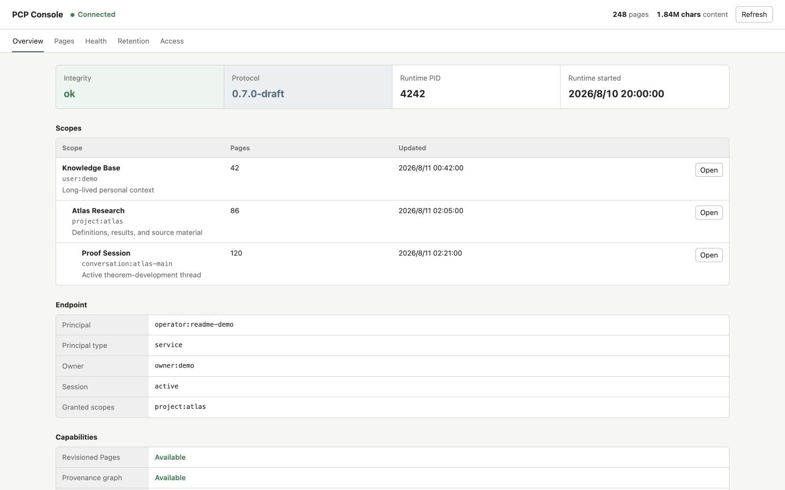

# Paged-Context-Protocol (PCP) - v0.8.0-draft

[中文](README.md) | **English**


An open protocol and its official implementation for deciding what user-owned
information enters model attention, when it enters, and with what identity and
evidence.

## Overview

Frontier models can search files, call tools, and manage long active contexts,
yet continuity across sessions, projects, and models is still commonly reduced
to coarse summaries or closed product Memory. For long-lived, high-density work,
the problem is not only whether information can be stored, but whether the right
material can be found, traced, and selectively admitted into finite attention.

**PCP defines a user-owned Identity and the paging
boundary between that space and model attention.** It is not a particular context
manager, Memory product, or Storage format, and it does not require all history to
be packed into one prompt. Context is an information continuum across time; the
model's active window is only a temporary working set.

```text
Multi-tenant Source / Event
  -> Identity + Scope                       (association boundary and authorization)
  -> stable Page + immutable Revision       (identity and storage)
  -> Relation / Provenance / Summary        (organization and evidence)
  -> Search / Read / Projection             (selection and materialization)
  -> Active working context                 (model attention)
```

## Protocol Core

- **Page and Revision**: A Page is the smallest semantic segment worth recalling
  independently; a Revision is an immutable content snapshot. Raw Pages are normally `sealed`, while maintained
  Pages may be `revisioned`.
- **Identity, Tenant, and Scope**: One Store/Runtime serves one durable Identity.
  Multiple tenants may contribute to one association space while reading only
  their authorized Scopes.
- **Scope and Access**: A unified address space is not global injection. Search,
  read, derivation, and write operations remain constrained by Scope and a
  server-injected access identity.
- **Relation and Provenance**: Relations connect stable Pages, while relation
  evidence and provenance refer to exact Revisions. Temporal adjacency or textual
  similarity does not automatically become a domain edge.
- **Summary and Validity**: Summaries are optional, sparse, traceable derived Pages
  rather than a mandatory tier for every item. Validity records whether information
  remains applicable.
- **Search, Read, and Projection**: Retrieval returns identifiable candidates before
  selected projections such as Summary, Payload, Sources, Relations, or History are
  read. The model or Host chooses the query path and admission timing.
- **Packing and Retention**: Fine-grained, source-contiguous, unreferenced sealed Pages
  may be packed losslessly into one Page. Historical Revisions are collected only when
  dependencies, leases, and retention rules permit. Lossy source condensation is outside v0.8.
- **External Media**: Tenants may retain image, audio, or video bytes while PCP
  stores a minimal verifiable SourceRef and searchable semantic representations. Missing
  originals degrade explicitly instead of silently erasing context.

PCP does not prescribe a fixed Router, Intent Focus, zoom hierarchy,
Chain-of-Thought, XML flow, or model state machine. A consuming model chooses what
the current task queries, reads, and materializes. Runtime owns Identity-wide
Summary, Validity, Relation, lossless packing, and retention maintenance and may call
a replaceable model as a semantic inference provider.

## Current Status

`v0.8.0-draft` is the current protocol draft. It separates Identity, tenant
Principal, and Scope; assigns global maintenance authority to Runtime; and accepts
text and external-media sources through a minimal SourceRef and simplified ingest
API. v0.8 is not compatible with v0.7 Stores; migration will re-import original
tenant-held content.

### Official Implementation

This repository is both the canonical home of the PCP specification and the
project-maintained official Rust implementation. It covers the Store, embedded
and remote clients, Unix-socket RPC, Runtime, automatic discovery and approved
client enrollment, CLI, MCP, Console, maintenance, and observation as an
end-to-end deployable PCP system.

PCP remains an open protocol that permits independent implementations. “Official”
means that this implementation is maintained and released by the PCP project; it
does not make SQLite, one retrieval algorithm, one model, or a Host workflow
normative. Conformance is defined by [`PROTOCOL-en.md`](PROTOCOL-en.md).



> Actual PCP Console interface shown with synthetic demo data. No real Page content,
> Scope, or client identity is included.

| Crate | Role |
| --- | --- |
| `pcp-core` | Core objects, requests, projections, and capability types |
| `pcp-store` | Database-independent Store contract with `AccessSession` |
| `pcp-client` | Tenant-facing `PcpTenantApi`, privileged Runtime `PcpApi`, and embedded client |
| `pcp-rpc` | Local Unix-socket wire, remote client, and server transport |
| `pcp-sqlite` | SQLite Page/Revision Store, retrieval, audit, and retention |
| `pcp-runtime` | Identity-bound endpoints, approved client enrollment, and global maintenance coordinator |
| `pcp-cli` | Inspection, retrieval, read, export, and retention operations |
| `pcp-mcp` | Local stdio tool server built on the official Rust MCP SDK |
| `pcp-console` | Independent read-only local Web Inspector |

### Implemented

- Stable Pages, immutable Revisions, `sealed`/`revisioned` behavior, and CAS updates.
- Head-only default retrieval, `auto`, `exact`, `text`, `graph`, and `temporal`
  modes, plus bounded Projection reads.
- Runtime-RPC `semantic_search` and budgeted `match_intent` context queries. Results are
  structured Page/Revision entries; callers assemble their own prompts without a fixed Context Pack prefix.
- Stable-`pageId` anchored graph slices with bounded depth, nodes, and edges, ACL-filtered at every hop; no whole-store graph export.
- Summary, Validity, Relation, Provenance, lossless sealed-Page packing, and access audit.
- Allowed access events are committed in bounded batches of at most 512 events or
  one second, with at least 500 ms between automatic commits; overload applies
  backpressure instead of silently dropping events. Denied and failed events use a
  security coalescing window of at most 100 ms once admitted to the writer and are
  durable before the call returns. Raw allowed events are retained for 30 days and
  pruned in batches of at most 5,000; this policy never automatically removes
  security-relevant events.
- Identity-bound embedded and RPC clients, discoverable user-approved Runtime
  enrollment, CLI, MCP, and Console.
- Simplified sealed `ingest_page` with Runtime-injected Identity and Actor, optional
  source-continuity `sourceSpan`, and a SourceRef containing only provider, locator,
  optional media type, and digest.
- Deterministic Revision-retention planning, finite leases, protected explicit
  collection, and multidimensional Health diagnostics.

### Not Yet Implemented

Durable Page deletion is currently absent from the Capabilities `features` list.
Cold storage, media-byte custody, external provider resolution, and
automatic OCR or transcription are not yet implemented. Identity-wide Validity
maintenance is also still pending.

### Implementation Boundary

The official implementation does not put a fixed semantic model or Router in the Store
contract. Runtime owns semantic-query and intent-match providers, budgets, validation,
and commit authority. If a required provider is absent, the method is explicitly unavailable
rather than silently falling back to keyword search. Console is a debugging and review client
of this same RPC contract, not another holder of provider credentials.

## Quick Start

The workspace currently uses Rust 2024 edition:

```bash
cargo test --workspace

PCP_STORE_PATH=data/context.sqlite3 \
  cargo run -p pcp-cli -- doctor

PCP_STORE_PATH=data/context.sqlite3 \
  cargo run -p pcp-cli -- retention-plan 30 2 100
```

`retention-plan` is a dry run. Its arguments are minimum age in days, recent
Revisions retained per Page, and candidate limit. Physical collection uses the
separate `retention-collect --confirm` command and replans exact Revision IDs
before submission.

## Deployment

`PcpTenantApi` is the ordinary tenant boundary and exposes the descriptor,
authorized Scopes, `ingest_page`, Search, Read, and optional browse. `PcpApi` is
the privileged superset used by Runtime maintainers and local administration
tools; it includes advanced writes, Relations, Summaries, Validity, packing,
retention, and audit. A Host may embed a Store or use Runtime for an independent
lifecycle and server-injected identity. The tenant surface is the same in both
deployment shapes.

```text
Tenant Host --> PcpTenantApi --> EmbeddedPcpClient --> PcpStore
                         `-----> RemotePcpClient ----> pcp-runtime --> PcpStore
Codex --------> MCP -----------> PcpTenantApi
Runtime/CLI -------------------> PcpApi
```

For multiple clients, start the broker from
[`examples/runtime.toml`](examples/runtime.toml). These static endpoints may
remain available while clients migrate to automatic discovery and enrollment:

```bash
cargo build --release -p pcp-runtime
target/release/pcp-runtime --config examples/runtime.toml
```

Each Unix socket maps to one fixed Principal injected by Runtime; requests cannot
choose their own identity. Socket mode is `0600`. This is a local-user boundary,
not protection from a hostile process already running as the same OS user. Strong
isolation requires separate endpoints, minimal Scopes, and separate model contexts,
because Storage authorization cannot retract information already visible to a model.

Runtime also advertises approved client enrollment through
[Infra Discovery](https://github.com/glenzli/infra-protocol). A local client
requests a Principal, access mode, and Scopes; after approval in Console it
receives an identity-bound RPC endpoint for the current generation. Following a
Runtime restart, it rediscovers and reopens the durable registration instead of
relying on a hard-coded socket path.

See [`crates/pcp-runtime/ENROLLMENT.md`](crates/pcp-runtime/ENROLLMENT.md) for the
complete contract and [Symbiont](https://github.com/glenzli/symbiont-d) migration
sequence.

### PCP-Owned Local Service

On macOS, PCP ships its own managed Console service. The Console owns the
`pcp-runtime` child, its Runtime configuration, Store, sockets, enrollment
state, maintenance ledger, and Console deep link under
`~/Library/Application Support/PCP` by default. Tenants discover and enroll;
they do not launch, restart, or configure Runtime.

```bash
sh scripts/install-macos.sh
```

The installed `com.glenzli.pcp-console` LaunchAgent starts `pcp-console
--managed`. The Console exposes a restart control only for that child and waits
for its stable operator socket before reporting success. The generated
`config/runtime.toml` keeps maintenance disabled until PCP is explicitly
configured with a worker; when enabled, the Runtime owns cadence and ledger
state even when the worker binary belongs to a tenant.

To import an existing Store before first launch, use PCP's consistent SQLite
backup path. Supplying the enrollment state preserves approved registrations.

```bash
sh scripts/import-store.sh \
  --source /absolute/path/to/context.sqlite3 \
  --enrollment-state /absolute/path/to/pcp-enrollments.json
```

### Runtime Maintenance

The maintenance coordinator is optional and defaults to observation without
applying changes. A configured semantic worker may return Summary content, an
ordered packing candidate, a two-Page `related_to` candidate, retention
milestones, `no_candidate`, or `defer`. It cannot write the Store directly.
Runtime owns candidates, budgets, relation type, basis Revisions, and commit
authority; Store revalidates authorization, exact current Revisions, source
continuity, external references, and atomicity. Packing and Relation maintenance
are independently opt-in. The maintainer never performs automatic Revision
collection. The official Runtime can use an independently authorized
[Infer Runtime](https://github.com/glenzli/infer-runtime) consumer or a local
command worker.

See [`crates/pcp-runtime/README.md`](crates/pcp-runtime/README.md).

### Infrastructure Observation

Runtime advertises a read-only observer capability through
[Infra Discovery](https://github.com/glenzli/infra-protocol).
[Infra Sentinel](https://github.com/glenzli/infra-sentinel) reads a versioned,
aggregate-only, redacted snapshot over an owner-only Unix socket: uptime,
24-hour calls, failures and denials, current Page count, and optional p95 latency
and telemetry coverage. Page content, queries, Scope names, raw audit, and
maintenance actions are excluded. Console is only an optional PCP snapshot deep
link, not part of discovery or the observer data interface.

See [`crates/pcp-runtime/OBSERVER.md`](crates/pcp-runtime/OBSERVER.md) for the
contract and Python wire example.

### Codex / MCP

MCP can open an embedded SQLite Store directly:

```bash
cargo build --release -p pcp-mcp
codex mcp add pcp \
  --env PCP_STORE_PATH=/absolute/path/to/context.sqlite3 \
  --env PCP_CLIENT_ID=codex:project-example \
  --env PCP_ACCESS_MODE=read \
  --env PCP_ALLOWED_SCOPES=project:example,conversation:example-main \
  -- /absolute/path/to/paged-context-protocol/target/release/pcp-mcp
```

Alternatively, MCP can connect to an identity-bound Runtime:

```bash
codex mcp add pcp \
  --env PCP_RUNTIME_SOCKET=/absolute/path/to/pcp-codex.sock \
  --env PCP_CLIENT_ID=codex:project-example \
  -- /absolute/path/to/paged-context-protocol/target/release/pcp-mcp
```

`PCP_ACCESS_MODE` may be `observe`, `read`, `contribute`, `audit`, `write`, or
`admin`. An ordinary writable tenant should use `contribute`: it adds only
`ingest_page` to Read and does not grant revision, Summary, Relation, Validity,
or packing authority. `write` and `admin` are privileged modes for Runtime
maintainers and local administration tools. `observe` can read aggregate Health
only; it cannot list or read Pages, search, read raw audit events, or invoke
maintenance actions. Cross-Scope derivation always requires a separate opt-in.
`pcp_whoami` reports the server-injected Principal and grants.
When connected to Runtime, MCP also provides `pcp_semantic_search` (semantic retrieval), `pcp_match_intent` (Router
intent matching), and `pcp_expand_graph` (an explicit-anchor bounded graph slice). Embedded Store
mode does not pretend to provide those Runtime-owned inference capabilities.

### Console

The Console should use a dedicated `audit` endpoint. Its Store Inspector is
read-only and exposes Page, Relation, access-timeline, Retention, and Health
views; control-plane actions approve, reject, or revoke local client
registrations, plus Runtime restart when Console owns that Runtime. Health presents storage shape, activity, recall, packing,
graph, and operations separately rather than as an opaque score. Operational
telemetry excludes query text and Page content.
Its query page renders the Runtime RPC's structured result and only builds a local inspection
preview; it does not carry a second retrieval implementation.

```bash
cargo build --release -p pcp-console
PCP_RUNTIME_SOCKET=/absolute/path/to/pcp-operator.sock \
PCP_CLIENT_ID=operator:local \
PCP_CONSOLE_BIND=127.0.0.1:4318 \
  target/release/pcp-console
```

Console and Runtime default to `pcp-enrollment-admin.sock` beside their static
endpoint. If the operator endpoint and the broker's first endpoint use different
directories, set the same absolute `PCP_ENROLLMENT_ADMIN_SOCKET` for both.

## Specification and History

- Current specification: [PROTOCOL-en.md](PROTOCOL-en.md)
- Chinese specification: [PROTOCOL.md](PROTOCOL.md)
- Runtime notes: [crates/pcp-runtime/README.md](crates/pcp-runtime/README.md)
- PCP Runtime observer contract: [crates/pcp-runtime/OBSERVER.md](crates/pcp-runtime/OBSERVER.md)
- PCP Runtime enrollment contract: [crates/pcp-runtime/ENROLLMENT.md](crates/pcp-runtime/ENROLLMENT.md)
- Historical generations and deprecation rationale: [deprecated/](deprecated/README.md)
- License: [MIT](LICENSE)
