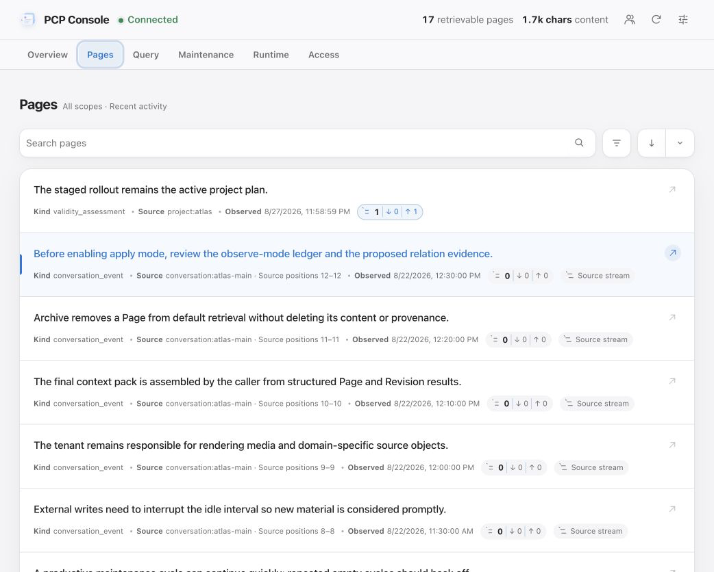

# Paged-Context-Protocol (PCP) · v0.8.0-draft

**中文** | [English](README-en.md)


> **协议草案与开发预览。** v0.8 的协议、接口和 Store 格式仍可能调整。v0.8 不兼容 v0.7 Store；迁移需要新建 Store，并从租户保留的原始内容重新导入。

PCP 是一个开放协议及项目维护的 Rust 实现，用于在应用、会话和模型之间保存、组织和检索长期上下文。它以稳定 Page、不可变 Revision、Scope、Relation 和 Provenance 表达内容，并通过有界查询把需要的部分交给当前任务。

PCP 可以作为单个应用的上下文层，也可以让多个租户在同一个 Identity 下贡献不同 Scope。具体产品可以把它用于长期记忆、项目知识、会话连续性或这些场景的组合。协议本身不区分“上下文库”和“记忆产品”，也不规定上层如何命名或呈现这些能力。

## 设计范围

```text
租户保留的来源
  -> Identity + Scope                    身份、授权与关联边界
  -> Page + immutable Revision           稳定记录与内容版本
  -> Relation + Provenance + Summary     组织、依据与派生内容
  -> Search + Read + Projection          有界检索与读取
  -> Host / 模型的当前工作上下文
```

- **Page 与 Revision**：Page 是可独立检索的记录；Revision 是不可变内容快照。原始记录通常为 `sealed`，维护型记录可以是 `revisioned`。
- **Identity、Tenant 与 Scope**：一个 Store/Runtime 服务一个持久 Identity。租户只能读写获授权的 Scope，请求身份由服务端注入。
- **Relation 与 Provenance**：Relation 连接稳定 Page；关系依据和派生来源引用精确 Revision。时间相邻或文本相似不会自动形成领域关系。
- **Search、Read 与 Projection**：检索先返回候选，再按需读取 Payload、Summary、Sources、Relations 或 History。Host 决定哪些结果进入当前上下文。
- **维护与治理**：Runtime 可以维护 Summary、Topic、Validity、Relation、无损 packing 和 retention。需要判断的变更进入同一套审阅流程；低风险操作是否自动应用由部署配置决定。
- **外部来源**：租户保管并理解自己的聊天记录、媒体或领域对象。PCP 保存最小 SourceRef 和可选 digest，并按授权返回来源坐标；来源解析、查询和展示仍由租户负责。

PCP 不规定 Router、提示词格式、Chain-of-Thought 或模型状态机。它只定义持久记录、授权、来源、检索和维护边界。SQLite、语义模型、Console 交互和具体 Host 工作流属于实现选择。

## 当前实现

本仓库包含规范和项目维护的 Rust 实现。当前实现可供本机应用通过 embedded client 或 Runtime RPC 接入，并提供 CLI、MCP 和本地 Console。

新客户端可以通过 [Infra Discovery](https://github.com/glenzli/infra-protocol) 发现 Runtime，申请 Principal、访问模式和 Scope，并在用户批准后取得当前 generation 的身份绑定端点。已批准的 registration 可在 Runtime 重启后重新发现并打开新会话。


*PCP Console 的本地 Store 概览。截图使用合成数据，不包含真实 Page、Scope 或客户端身份。*

### 已实现

- 稳定 Page、不可变 Revision、`sealed`/`revisioned` 行为和 CAS 修订。
- `exact`、`text`、`graph`、`temporal` 与 `auto` 检索，以及有界 Projection 读取。
- Runtime RPC 的 `semantic_search`、`match_intent` 和显式锚点图扩展。
- Summary、Topic、Validity、Relation、Provenance、archive/restore、无损 sealed-Page packing 和访问审计。
- Runtime 注入 Identity 与 Actor 的 `ingest_page`，包括可选 `sourceSpan`、`basedOnRevisionIds` 和最小 SourceRef。
- embedded/RPC client、授权注册、CLI、MCP、Console、维护协调器和只读设施观测。
- 确定性 Revision 保留规划、有限租约和受保护的显式回收。



*Pages 视图展示 Page 类型、Scope、来源区间和直接关系。内容均为合成演示数据。*

### 当前边界

- Durable Page deletion、cold storage 和 Identity 全局 Validity 维护尚未实现；`purge` 不属于 v0.8。
- 外部来源的托管、解析、检索、展示、OCR 和转写由租户实现。
- 语义查询依赖显式配置的 Provider；缺少 Provider 时返回不可用，不自动改用关键词查询。
- 本地 Unix socket 的 `0600` 权限是 OS 用户边界，不能防御同一用户下运行的恶意进程。
- 公共协议的合规边界以 [`PROTOCOL.md`](PROTOCOL.md) 为准，而不是本仓库的某个具体后端或界面。

## 仓库结构

| Crate | 职责 |
| --- | --- |
| `pcp-core` | 核心对象、请求、投影与 capability 类型 |
| `pcp-store` | 携带 `AccessSession` 的数据库无关 Store 契约 |
| `pcp-client` | 租户 `PcpTenantApi`、特权 `PcpApi` 与 embedded client |
| `pcp-rpc` | Unix socket 协议、remote client 与 server transport |
| `pcp-sqlite` | SQLite Store、检索、审计与 retention |
| `pcp-runtime` | 身份绑定端点、客户端注册与维护协调器 |
| `pcp-cli` | 检查、检索、读取、导出与保留操作 |
| `pcp-mcp` | 本地 stdio MCP server |
| `pcp-console` | 本地 Store Inspector、审阅和治理入口 |

## 快速开始

Workspace 使用 Rust 2024 edition：

```bash
cargo test --workspace

PCP_STORE_PATH=data/context.sqlite3 \
  cargo run -p pcp-cli -- doctor

PCP_STORE_PATH=data/context.sqlite3 \
  cargo run -p pcp-cli -- retention-plan 30 2 100
```

`retention-plan` 是 dry run。实际回收使用 `retention-collect --confirm`，并在提交前重新规划精确 Revision ID。

## 部署

`PcpTenantApi` 是普通租户接口，提供 descriptor、授权 Scope、`ingest_page`、Search、Read 和可选 browse。`PcpApi` 是 Runtime 维护器与本机管理工具使用的特权超集。Host 可以嵌入 Store，也可以连接独立 Runtime：

```text
Tenant Host --> PcpTenantApi --> EmbeddedPcpClient --> PcpStore
                         `-----> RemotePcpClient ----> pcp-runtime --> PcpStore
Codex --------> MCP -----------> PcpTenantApi
Runtime/CLI -------------------> PcpApi
```

启动多客户端 Runtime：

```bash
cargo build --release -p pcp-runtime
target/release/pcp-runtime --config examples/runtime.toml
```

每个 RPC endpoint 绑定一个由 Runtime 注入的 Principal，请求不能自选身份。需要隔离不同租户或模型上下文时，应使用独立端点和最小 Scope。

### macOS 受管服务

PCP 可以通过本地 Console 服务托管 `pcp-runtime`、Store、socket、enrollment state 和 maintenance ledger。默认数据目录为 `~/Library/Application Support/PCP`：

```bash
sh scripts/install-macos.sh
```

LaunchAgent `com.glenzli.pcp-console` 启动 `pcp-console --managed`。生成的 Runtime 配置默认关闭自动维护；部署者配置独立授权的 worker 后，可选择 observe 或 apply 模式。

首次启动前可以导入已有 Store 和 enrollment state：

```bash
sh scripts/import-store.sh \
  --source /absolute/path/to/context.sqlite3 \
  --enrollment-state /absolute/path/to/pcp-enrollments.json
```

### MCP

MCP 可以直接打开 embedded Store：

```bash
cargo build --release -p pcp-mcp
codex mcp add pcp \
  --env PCP_STORE_PATH=/absolute/path/to/context.sqlite3 \
  --env PCP_CLIENT_ID=codex:project-example \
  --env PCP_ACCESS_MODE=read \
  --env PCP_ALLOWED_SCOPES=project:example,conversation:example-main \
  -- /absolute/path/to/paged-context-protocol/target/release/pcp-mcp
```

也可以连接身份绑定的 Runtime：

```bash
codex mcp add pcp \
  --env PCP_RUNTIME_SOCKET=/absolute/path/to/pcp-codex.sock \
  --env PCP_CLIENT_ID=codex:project-example \
  -- /absolute/path/to/paged-context-protocol/target/release/pcp-mcp
```

普通可写租户应使用 `contribute`；它只在 Read 基础上增加 `ingest_page`。`write` 和 `admin` 仅用于维护器和本机管理工具。完整访问模式与 enrollment 合同见 [`crates/pcp-runtime/ENROLLMENT.md`](crates/pcp-runtime/ENROLLMENT.md)。

### 维护、Console 与观测

后台维护与 Console 手动运行共用持久审阅队列。Worker 只产生候选，Runtime 和 Store 负责预算、授权、当前 Revision 校验与提交；需要人工判断的 Relation、Topic 和 Archive 建议在应用前审阅。调度、模型升级和失败退避见 [`crates/pcp-runtime/README.md`](crates/pcp-runtime/README.md)。

Console 应连接独立的 `audit` endpoint。它提供只读 Store 检查、查询预览、注册管理、维护审阅和受权 archive/restore。Runtime 的设施 observer 只返回聚合且脱敏的运行数据；合同见 [`crates/pcp-runtime/OBSERVER.md`](crates/pcp-runtime/OBSERVER.md)。

```bash
cargo build --release -p pcp-console
PCP_RUNTIME_SOCKET=/absolute/path/to/pcp-operator.sock \
PCP_CLIENT_ID=operator:local \
PCP_CONSOLE_BIND=127.0.0.1:4318 \
  target/release/pcp-console
```

## 文档

- [当前协议](PROTOCOL.md)
- [英文协议](PROTOCOL-en.md)
- [Runtime 说明](crates/pcp-runtime/README.md)
- [Enrollment 合同](crates/pcp-runtime/ENROLLMENT.md)
- [Observer 合同](crates/pcp-runtime/OBSERVER.md)
- [历史版本与淘汰原因](deprecated/README.md)
- [MIT License](LICENSE)
